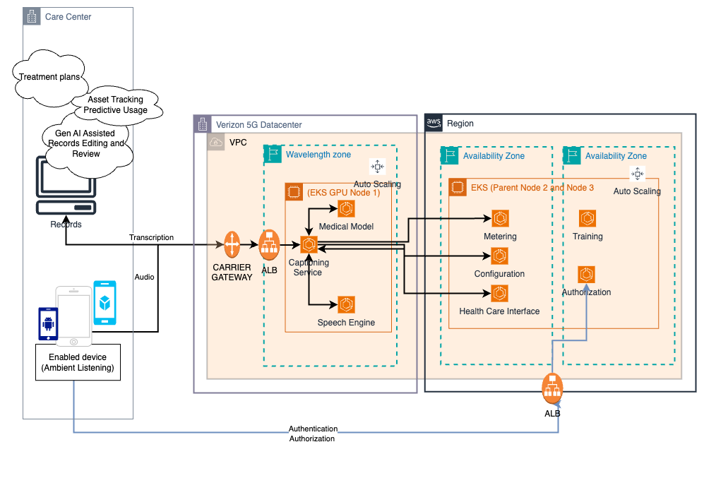

#### Entire code is not available in this repo as this is Paid app 

#### Session coordinator is python websocket FastAPI stream deployed in EKS Pod. this is used for communication between Angular App and all backend endpoints.

##### Brief: The University of South Carolina (College of Nursing) is facing a significant challenge. Employed nurses/doctors are increasingly overwhelmed as they try to balance high-quality patient care with the need for accurate and timely documentation. In addition, addressing patient concerns often requires nurses to search through very large, complex U.S. medical books, which is time-consuming and inefficient. As Nurses does not have enough knowledge to use many new medical equipment such as Incentive Spirometer. This challenge can be effectively addressed using an Agentic Multimodal RAG approach, which enables nurses to quickly retrieve relevant, reliable medical information and focus more on patient care. 
##### This application is developed in Angular.  The architecture is split into Verizon 5g Edge (Datacenter) and AWS Cloud (Region). This Angular App has several endpoints few are shown below. Every endpoint click goes to session coordinator which does coordination between the App Endpoints and Verizon datacenter and AWS Atlanta Region. On premise model speechmatics is deployed in 5g Verizon datacenter for milliseconds latency , every speech to text conversation transript is saved as unique Encounter id.
##### How it works : Nurse switch On app in her phone. Login in to App with email id and password. Session coordinator python websocket application authrorizes this email id refering to email id stored in Open EMR. For each patient/nurse conversation unique Encounter Id is generated and stored in OpenEMR. Based on Endpoint is clicked that particular route is processed by Sesssion coordinator in AWS Atlanta region. If New Visit  is clicked then app request goes to Session coordinator which calls Speecmatics On premises model for speech to text inside Verizon 5g data center. Once conversation is finished automatically an Llama-3-70b model linked Pydantic output parser hits prompt to extract Vitals and stores in OpenEMR . for example – Heart Rate , Oxygen Saturation (Sp02),  Temperature , Blood pressure etc.  Open EMR records every patient conversation and history of each endpoint. 
##### If Additional recommendations endpoint is clicked in app it calls session handler which authenticates patient via Open EMR. Once authentication is successful session handler invokes Agentic RAG flow endpoint in AWS EKS Pod.  Additional recommendations Endpoint calls Langgraph Agentic RAG.  this conversation transcript (ie Encounder id Transcript ) is input to multimodal RAG Agent to query our database. Our database is loaded with documents provided by U.S. Govt healthcare providers we have created index for each device –for example incentive spirometer , purewick catheter , pressure injury devices etc.  Based on conversation transcript Agent assess which index to invoke to provide additional recommendations to nurse conduct and provide detailed explaination of how to use medical device (diesease as per conversation transcript). Built RESTful services in Python to handle ingestion, batching of embeddings, semantic search endpoints , and agent orchestration; containerized and deployed in AWS EKS pod Atlanta Region.

##### This app is a Live multi Agentic workflow assisting nurse/doctors in their everday work.

